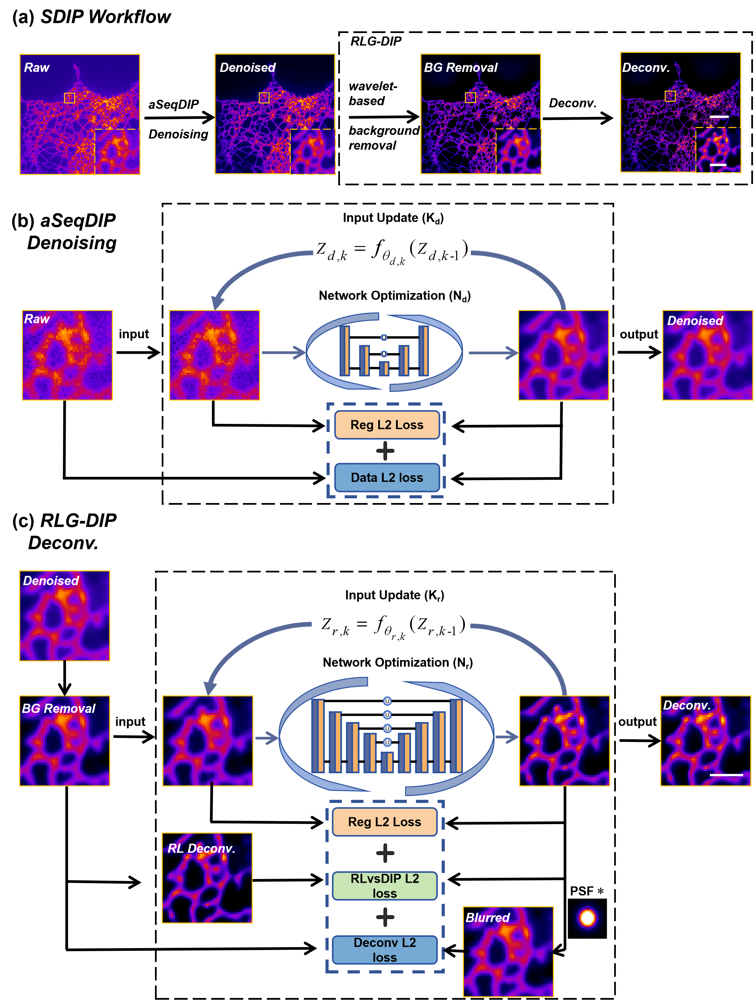
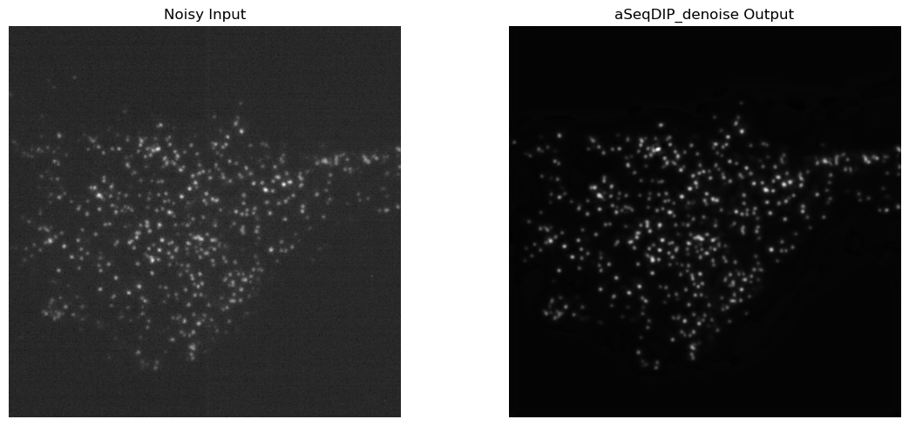
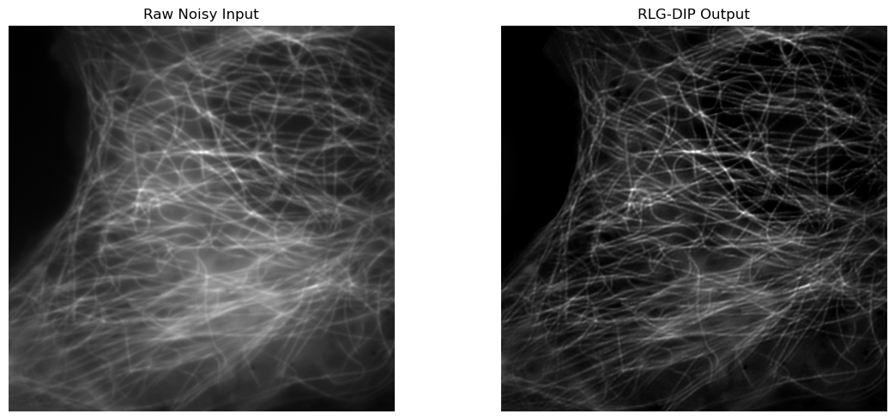
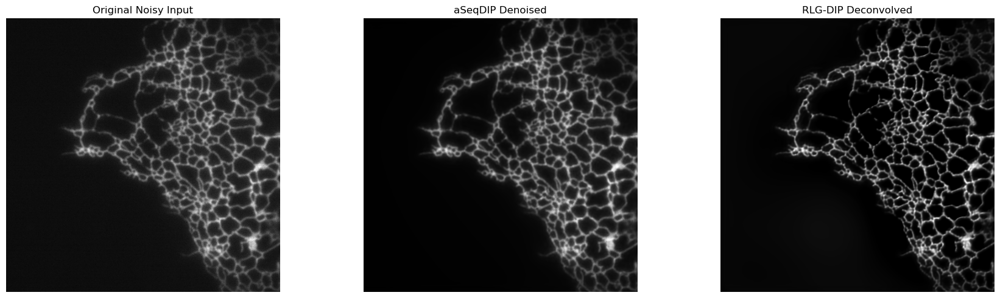

# SDIP: Zero-Shot Deep Image Prior Framework for Fluorescence Microscopy Restoration

> **A Zero-Shot Deep Image Prior Framework for Denoising and Deconvolution in Fluorescence Microscopy**
Fluorescence microscopy images are often degraded by photon-limited noise, out-of-focus background, and diffraction-induced blur. These degradations reduce signal-to-noise ratio, blur fine cellular structures, and limit downstream quantitative analysis.
SDIP is a zero-shot fluorescence microscopy image restoration framework for single-image denoising and deconvolution. It does not require paired training data or a pre-trained model. Given a degraded wide-field fluorescence image, SDIP first suppresses noise using an aSeqDIP denoising module, then performs wavelet-based background correction and RLG-DIP deconvolution to improve structural resolution and suppress deconvolution artifacts.

<p align="center">
  
</p>


## Installation Requirements

```bash
conda create -n dip_env python=3.7.1 numpy=1.21.5 scipy=1.7.3 scikit-image=0.19.3 matplotlib=3.5.3 tifffile=2021.7.2 imageio=2.19.3 opencv=3.4.2 pywavelets=1.3.0 pandas=1.3.5 jupyter=1.0.0 tqdm=4.67.1 pytorch=1.12.1 torchvision=0.13.1 torchaudio=0.12.1 cudatoolkit=11.6 -c pytorch -c conda-forge

```

## Main Parameters

### aSeqDIP Denoising Parameters

| Parameter | Default | Description |
|---|---:|---|
| `num_epochs` | `2000` | Number of sequential optimization epochs |
| `inner_iterations` | `10` | Network optimization steps within each epoch |
| `learning_rate` | `1e-4` | Adam optimizer learning rate |
| `data_weight` | `1.0` | Weight of the data fidelity loss |
| `reg_weight` | `1.0` | Weight of the autoencoding regularization loss |
| `fname_noisy` | user-defined | Path to the noisy input TIFF image |
| `fname_gt` | optional | Path to clean ground truth, used only for evaluation/selection |

### RLG-DIP Deconvolution Parameters

| Parameter | Default | Description |
|---|---:|---|
| `NA` | `1.3` | Numerical aperture |
| `wavelength` | `488` | Excitation/emission wavelength used for PSF generation |
| `sizePixel` | `6.26` | Pixel size parameter used in PSF generation |
| `MA` | `100` | Microscope magnification |
| `num_epochs` | `2000` | Number of sequential optimization epochs |
| `inner_iterations` | `10` | Network optimization steps within each epoch |
| `learning_rate` | `1e-4` | Adam optimizer learning rate |
| `data_weight` | `1.0` | Weight of the data fidelity loss |
| `reg_weight` | `1.0` | Weight of autoencoding regularization |
| `rl_weight` | `1.0` | Weight of RL-guided regularization |
| `rl_iterations` | `10` | Number of Richardson--Lucy iterations used to compute the RL prior |

## Usage Examples

### 1. aSeqDIP Denoising

Open and run:

```text
aSeqDIP.ipynb
```

Default input path:

```python
base_path = './image/aSeqDIPdenoise'
fname_noisy = './image/aSeqDIPdenoise/CCPsRaw.tiff'
```

If a clean ground truth image is available, uncomment and set:

```python
fname_gt = './image/aSeqDIPdenoise/CCPsgt.tiff'
```

The notebook will display the raw input and the aSeqDIP denoised output.
<p align="center">
  
</p>

### 2. RLG-DIP Deconvolution

Open and run:

```text
RLG-DIP.ipynb
```

Default input path:

```python
base_path = './image/aSeqDIPdenoise'
fname_noisy = './image/aSeqDIPdenoise/Micritubules-Raw.tiff'
```

Main optical parameters:

```python
NA = 1.3
wavelength = 488
sizePixel = 6.26
MA = 100
```

The notebook generates PSF/OTF, computes the RL guidance prior.
The notebook will display the raw input and the RLG-DIP deconvolution output.
<p align="center">
  
</p>

### 3. Full SDIP Pipeline

Open and run:

```text
SDIP.ipynb
```

Default input path:

```python
base_path = './image/SDIP'
noisy_fname = './image/SDIP/ER10-raw.tiff'
```

The full pipeline performs:
The notebook will display the raw input , aSeqDIP denoised output and the RLG-DIP deconvolution output.
<p align="center">
  
</p>


## Notes on Data

This project was evaluated on fluorescence microscopy images such as the BioSR dataset. A typical input image can be obtained by averaging the raw wide-field frames. For quantitative evaluation:

- high-SNR images can be used as references for denoising evaluation;
- SIM reconstructed images can be used as references for deconvolution/restoration evaluation;
- PSNR and SSIM can be used to evaluate restoration fidelity;
- decorrelation analysis can be used to estimate effective resolution.
- Please set `NA`, `wavelength`, `sizePixel`, and `MA` according to your microscope.

## Citation

If you find this project useful, please cite our work


